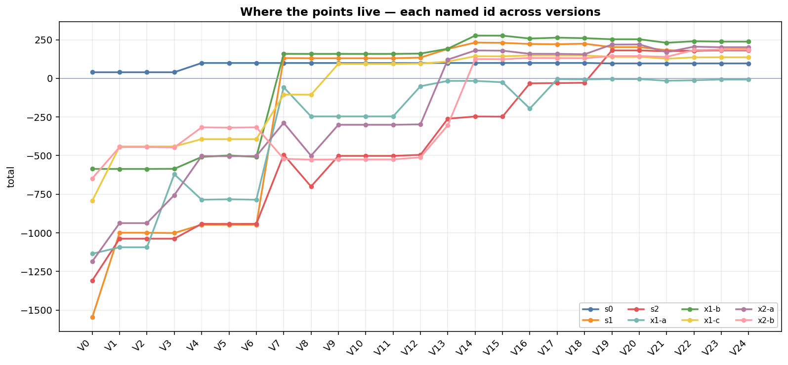
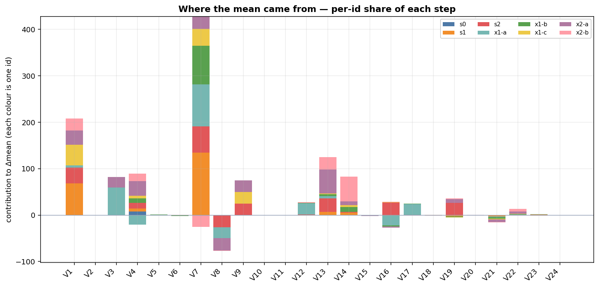
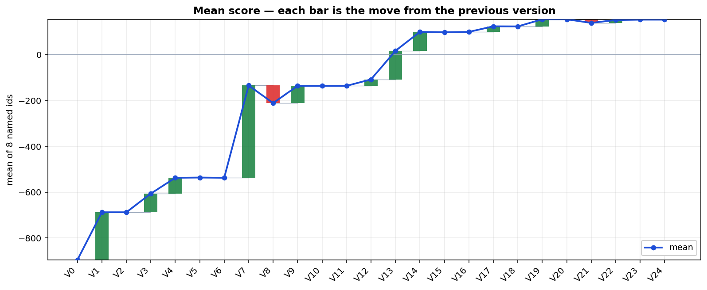

# Results

Scores come from the report JSON of each run. Runs are deterministic from their
scenario id, and scores are bit-identical across machines and thread counts, so
every number here is directly comparable.

Generated ids were drawn with `--new-token`, not chosen by hand.

**Sweep set (8 scenarios, used for the version ladder below):**
`s0, s1, s2, x1-a, x1-b, x1-c, x2-a, x2-b`

The live brain is **V24** (working tree: D75 connect-first abort, on top
of D70 slack and D72 picket 20 m). **V23** is a frozen sitting-wall
snapshot, not live. Figures: `notes/ablation-ladder.png` and friends,
including attribution plots (`ablation-ids.png`, `ablation-delta.png`,
`ablation-waterfall.png`), generated by `tools/plot_ablation.py`. The
git ladder is `scripts/ablation.ps1`, not `scripts/history.ps1` (that
one is the iterate CSV). How we tested: `notes/workflow.md`.

Gaps we did not close — encryption, insiders, leftover GUESS constants —
are `notes/GAPS.md`.

---

## Live brain (V24 / 8 named)

| scenario | total | hostiles stopped | breaches | wasted | civ | aware | comms | notes |
| --- | ---: | :---: | :---: | ---: | ---: | ---: | ---: | --- |
| x1-b | **237.6** | 4/4 | 0 | 0 | 0 | 53.4 | 36.1 | best run |
| x2-a | 201.1 | 4/4 | 0 | 0 | 0 | 51.9 | 35.5 | |
| s1 | **188.4** | 6/6 | 0 | 0 | 0 | 53.4 | 34.3 | all six stopped |
| x2-b | 185.5 | 3/3 | 0 | 0 | 0 | 52.5 | 29.0 | V10 was 0/3; closed since V14 |
| s2 | 180.3 | 6/6 | 0 | 0 | 0 | 57.5 | 32.4 | hops + live roster |
| x1-c | 136.2 | 3/3 | 0 | 0 | 0 | 49.6 | 35.7 | |
| s0 | 96.6 | 0/0 | 0 | 0 | 0 | 60.0 | 36.6 | no threats; comms pays D56 hops |
| x1-a | **−7.7** | 4/4 | 0 | 0 | 2 | 42.2 | 35.9 | **worst** — two civilians, D44 |

**min −7.7 · mean 152.3 · max +237.6.** Breaches on this set: **0.**
Detection is `n/a` / 0: `declare_identity` is never called.

Hard generated ids (not in the eight): canary
`x1-06b926af3deab4600494418d7ece5944` **3/3 +87.1**, wasted 0; fa56
`x2-fa56ef171718281fef54383d2dba36d6` **3/3 +83.2**. D75 exists for the
canary dual-ram, not for a move on this eight (V23 sitting-wall was a
wash here).

s3 (hardening, D76): **6/6 +172.8**, 0 breaches, 0 civilians. Hop-0
TrackReport now carries the author's pose and must match `SwRxFrame.range`
(same residual as heartbeats, plus 15 m outbox pad). Without that gate
s3 was already +192.2 6/6; this is not a rescue. Hopped reports are still
trusted. Identity eight is a wash (floor −7.7 → −7.9). Three fresh x3:
+54.4 (3/3, 1 ground waste — F2, not impersonation), +127.1 4/4,
+198.6 3/3.

V10 on the same eight was min **−524.6** (x2-b 0/3, three breaches),
mean **−136.4**. The floor moved off breaches and onto x1-a's civilian
chords.

---

## Tier 2 — hops (`s2` + four generated ids)

CHALLENGE.md §14.7 / the hop check: information has to cross the fleet,
because on tier 2 the arrival is 220 m out and only one drone can see it.
Read the **worst** run, not the mean. Drawn this session with `--new-token`,
not reused from the identity eight. Baseline is the V10 brain (no
TrackReport hops).

```
s2
x2-3eeb7e3df1cee611bbcfdda558404df0
x2-63dad4d1aaff755add3981e4aaa8ccb5
x2-6878d2031c0dded570deced57de97f8c
x2-3c6916869d57804ad923813e2cec47ff
```

**5/5 completed.** No crash, no hang, no ABI violation.

s2 in this table is **180.7** — the hop-check run, not the identity-eight
cell (**180.3** on V24). Do not flatten those into one “live s2”.

### Hop brain vs V10 (same five ids)

| scenario | this brain | stopped | V10 | V10 stopped |
| --- | ---: | :---: | ---: | :---: |
| x2-6878d203… | **−170.3** | 3/3 (2 civ) | −423.1 | 2/3, 1 breach |
| x2-3c691686… | 159.3 | 3/3 | 145.3 | 3/3 |
| s2 | 180.7 | 6/6 | **−501.9** | 3/6, 3 breaches |
| x2-3eeb7e3d… | 208.4 | 3/3 | −74.0 | 2/3, 1 breach |
| x2-63dad4d1… | 276.8 | 4/4 | −62.7 | 3/4, 1 breach |

**worst −170.3 · mean 131.0.** The floor is civilians, not a breach.
**Breaches this set: 0** (V10: 6). Hopped p95 on these runs is
0.07–0.11 s. Reports: `runs/sweep_tier2_now/` vs `runs/sweep_tier2_v10/`.

---

## How it got here — version ladder

Each row is a real commit (V24 is the working tree; V23 is a frozen
sitting-wall snapshot), rebuilt from git history and swept over the same
8 scenarios. Deltas are on the **minimum**, because §11.2 says the floor
is what gets graded. Re-measured 2026-09-04 (`scripts/ablation.ps1 -All`
through V22; V23 snapshot; V24 `-Current`). V3's mean moved 4.8 vs an
older table; the rest of V0–V10 matched.








| ver | commit | change | min | mean | max | Δmin |
| --- | --- | --- | ---: | ---: | ---: | ---: |
| V0 | `5589171` | skeleton (untested draft) | −1546.9 | −895.3 | 39.6 | — |
| V1 | `80c589e` | D2 aimed-at-asset + CPA discriminant | −1093.4 | −687.6 | 39.6 | **+454** |
| V2 | `33f8984` | D3/D4 diagnostic logging | −1093.4 | −687.6 | 39.6 | 0 |
| V3 | `ad2cc9f` | D7 miss distance becomes 3D | −1037.9 | −606.2 | 39.6 | +55 |
| V4 | `dd447fe` | D8 friendly ID from heartbeats | −947.2 | −537.2 | 99.4 | +91 |
| V5 | `8ab1263` | D10 asset is a cylinder | −948.2 | −536.1 | 99.4 | −1 |
| V6 | `917346a` | fix: hostile calling restored | −947.2 | −537.2 | 99.4 | +1 |
| V7 | `2522c14` | D11 commit only a catchable intercept | −521.2 | −134.7 | 158.6 | **+426** |
| V8 | `2d75837` | D13 local tracks die with sensor picture | −700.0 | −211.4 | 158.4 | **−179** |
| V9 | `8664314` | D15 one owner per hostile + yield | −524.6 | −136.4 | 158.4 | +175 |
| V10 | `366fd4d` | viewer-side; brain matches V9 | −524.6 | −136.4 | 158.4 | 0 |
| V11 | `8fce68a` | D17 corridor horizon (yield) | −524.6 | −136.4 | 158.4 | 0 |
| V12 | `0b4d519` | hops (TrackReport / Ray) | −511.1 | −108.2 | 160.3 | +13 |
| V13 | `a3898dc` | D21 local bisection + radio ring | −303.8 | 16.3 | 191.9 | **+207** |
| V14 | `b3bf0e8` | collision course (meet, not wait) | −246.8 | 99.1 | 276.7 | +57 |
| V15 | `94510d7` | spawn-circle picket cap | −247.9 | 97.3 | 276.4 | −1 |
| V16 | `4e5a660` | D44 early scramble | −195.7 | 98.9 | 257.7 | +52 |
| V17 | `132140e` | named flight state machine | −30.6 | 123.2 | 263.3 | **+165** |
| V18 | `c5c3fc1` | D52 ray picket altitude | −28.6 | 122.8 | 260.1 | +2 |
| V19 | `51a9571` | D56 hopped heartbeats (live roster) | −4.5 | 153.8 | 253.0 | +24 |
| V20 | `6e5c69b` | D66 handoff to the mover | −4.5 | 153.9 | 253.0 | 0 |
| V21 | `fa3b01c` | D66/D67 InterceptScore + orbit | −15.4 | 138.1 | 230.3 | −11 |
| V22 | `7d77194` | D70 cover slack 5 m | −12.1 | 150.7 | 240.2 | +3 |
| V23 | SNAPSHOT | D71 sitting-wall, D72 H=20 (frozen) | **−7.7** | 152.3 | 237.6 | +4 |
| V24 | WORKING | D75 connect-first abort | **−7.7** | **152.3** | 237.6 | 0 |

Total: **−1546.9 → −7.7 on the floor, −895.3 → +152.3 on the mean.**
The floor stopped being a breach bill at V19. V24 is a wash on min / mean /
max of this eight (mean 152.3 is half-up of 152.25; per-id cells shuffle
by ≤ 0.4). The canary dual-ram is why D75 replaced D71.

---

## What each step did

**V1 — the discriminant (+454 floor).** Replacing the 24 m gate with
"sure hit, or the miss has shrunk" removed civilian kills on 4 of 8
scenarios. Biggest single fix to the floor.

**V2 — logging (0).** Behaviour unchanged. Measures that logs are not
on the command path.

**V3 — 3D miss (+55 floor).** Small overall, +473 on x1-a alone. A chord
that misses by 5 m on the ground can be 30 m away in altitude.

**V4 — friendly ID (+91 floor).** Heartbeat match. s0 jumps by the
awareness term. Last `pair_friendly` on x2-b goes to 0.

**V5 → V6 — a bug the score could not see (±2).** V5 accidentally stopped
declaring hostiles. `wrong_declarations` swung; the total barely moved.

**V7 — the commit rule (+426 floor, +1078 on s1).** Only commit to a
hostile we can catch. s1: 1 kill / 5 breaches → 6/6. x2-b got *worse*
(never commits). That hole is closed later, not by relaxing this bar.

**V8 — track drop (−179 floor).** Dropping local tracks at the sensor
edge cost 200+ on s2 / x1-a / x2-a. s1 unchanged. Why the sweep exists.

**V9 — one owner per hostile (+175 floor).** Recovered almost exactly
what V8 lost. Fleet stopped converging on the same target.

**V10 — viewer-side (0).** Brain matches V9.

**V11 — corridor horizon (0 on this set).** Yield uses remaining intercept
flight, not the whole chord. Load-bearing later; the eight named scores
do not move yet.

**V12 — hops (+13 floor).** TrackReport / Ray cross the radio horizon.
x1-a −246 → −51 (civilians, not a new leak). s2 still 3/6, x2-b still
0/3. Hops without a live roster are not enough for s2's late pair.

**V13 — ring / bisection (+207 floor).** Mean crosses zero. x2-a 4/4.
s2 4/6. x2-b 1/3. Neighbour chord stays inside radio; ring does not grow.

**V14 — collision course (+57 floor).** Meet the inbound rather than wait
on the slot. x2-b 3/3 (+125). Floor becomes s2 (−247, still 2 breaches).
s1 6/6 +231.

**V15 — spawn-circle cap (−1).** Safety cap. Wash on the eight.

**V16 — early scramble (+52 floor).** Leave the ring before the Hostile
latch when the ground track already crosses the cylinder. x2-b stays 3/3.
s2 5/6. Floor becomes x1-a (−196, 3 civilians). Frozen trade (D44).

**V17 — named state machine (+165 floor).** x1-a 3 civ → 2 (−5). s2 still
one breach (−31). Modes are inspectable; the score move is the abort /
scramble split becoming explicit.

**V18 — ray picket altitude (+2).** Station height follows the inbound
cone. Does not close s2's last breach by itself.

**V19 — hopped heartbeats (+24 floor, s2 6/6).** Live roster from relays.
s2 −29 → **+181, 6/6**. Floor is x1-a (−4.5, 2 civ) from here on.
Mean 154. This is the s2 close, not hops-alone (V12).

**V20 — handoff (0).** Challenger with a better intercept takes the
inbound. Identity eight is a wash; it is the setup for orbit.

**V21 — InterceptScore + orbit (−11 floor, −16 mean).** ω = 0.06. Facing
slot with a moving ring is the *wrong* interceptor unless handoff is on.
Pays on generated canaries more than on this eight. Mean dip is real.

**V22 — cover slack 5 m (+3 floor, +13 mean).** Shrink until leftover
Reach ≥ 5 m. Identity eight does not bind; generated cover does.

**V23 — sitting wall + default 20 m (+4 floor, frozen).** Parked facing
picket counted as a duplicate if ≥ 12 m closer. That gap was a fit to one
canary (14 m vs fa56's 10.4 m). Kept on the ladder as a snapshot.

**V24 — connect-first abort (0 on min / mean / max).** Same `InterceptScore`
the ram flies: a mate who connects first is the duplicate; a parked picket
that *could* connect is not. Identity eight min/mean/max match V23; s1
188.0 → 188.4 is the largest per-id shuffle, not the reason D75 shipped.
Canary 3/3 +87.1, wasted 0. Do not lower `kChasingToward`.

---

## Worst case (live)

The floor is **x1-a, −7.7**: 4/4 hostiles, 0 breaches, 2 civilians.
That is D44, not a leak of the catchable bar. Awareness is also lowest
here (42.2). s2 / x2-b / x2-a are no longer worst-case stories.

V10's floor (x2-b −524.6, 0/3, three × −200) is closed.

---

## Saved artifacts

`notes/ablation-*.png` and `notes/ablation-summary.md` are the ladder
figures. Attribution (where points go) is `ablation-ids.png` (each id
across versions), `ablation-delta.png` (each id's share of Δmean),
`ablation-waterfall.png` (Δmean as bars). `notes/workflow.md` is
the test loop. `notes/GAPS.md` is the unfinished list.
`notes/sense-sample.json` is generated-id `sense_radius` (mean 76.1 m,
SD 15.9); Cover already uses boot, not this mean.

`runs/ablation/` is local only (gitignored). Each version has reports,
`summary.csv`, `log.txt`, `meta.json`.

```
scripts/versions.csv                version → commit, expected min/mean/max, worst
runs/ablation/<ver>/                rebuilt reports
notes/ablation-*.png                ladder figures
```

`runs/history.csv` is the live iterate log from `scripts/iterate.ps1`,
shown by `scripts/history.ps1`. It is incomplete, which is why the ladder
is rebuilt from git.

---

## Reproducing the ladder

```
powershell -ExecutionPolicy Bypass -File scripts\ablation.ps1 -List
powershell -ExecutionPolicy Bypass -File scripts\ablation.ps1 -Version V19
powershell -ExecutionPolicy Bypass -File scripts\ablation.ps1 -Current
powershell -ExecutionPolicy Bypass -File scripts\ablation.ps1 -All
python tools\plot_ablation.py --update-csv
```

`-Current` / commit `WORKING` copies live `brain/src` so uncommitted D75
appears as V24. Do not cite HEAD as V24. V23 is `SNAPSHOT` (frozen
sitting-wall tree on disk). A drift warning means the live score is more
than 0.15 off `scripts/versions.csv`. Means round half-up to 0.1
(152.25 → **152.3**).
