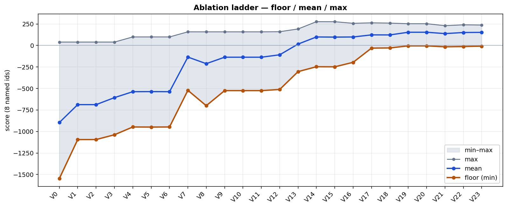
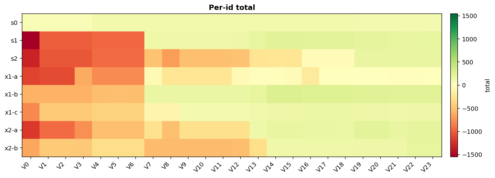
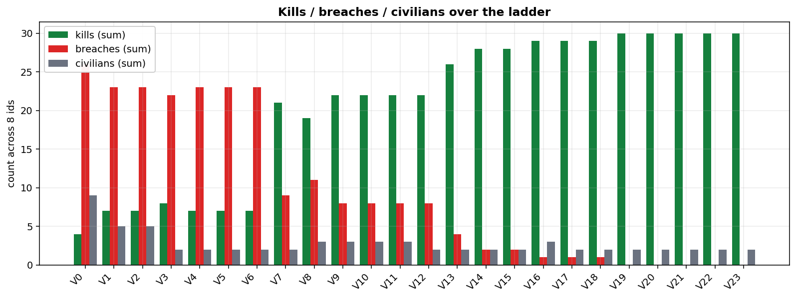
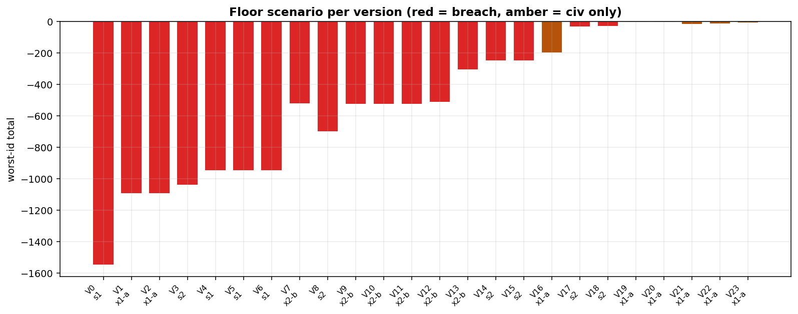

# Ablation ladder

Generated by `tools/plot_ablation.py` from `runs/ablation/`.
`scripts/history.ps1` is the iterate CSV, not this table.

| ver | commit | change | min | mean | max | worst |
| --- | --- | --- | ---: | ---: | ---: | --- |
| V0 | `5589171` | skeleton (untested draft) | -1546.9 | -895.3 | 39.6 | s1 |
| V1 | `80c589e` | D2 aimed-at-asset + CPA discriminant | -1093.4 (+453.5) | -687.6 | 39.6 | x1-a |
| V2 | `33f8984` | D3/D4 diagnostic logging | -1093.4 (+0.0) | -687.6 | 39.6 | x1-a |
| V3 | `ad2cc9f` | D7 miss distance becomes 3D | -1037.9 (+55.5) | -606.2 | 39.6 | s2 |
| V4 | `dd447fe` | D8 friendly ID from heartbeats | -947.2 (+90.7) | -537.2 | 99.4 | s1 |
| V5 | `8ab1263` | D10 asset is a cylinder | -948.2 (-1.0) | -536.1 | 99.4 | s1 |
| V6 | `917346a` | fix: hostile calling restored | -947.2 (+1.0) | -537.2 | 99.4 | s1 |
| V7 | `2522c14` | D11 commit only a catchable intercept | -521.2 (+426.0) | -134.7 | 158.6 | x2-b |
| V8 | `2d75837` | D13 local tracks die with sensor picture | -700.0 (-178.8) | -211.4 | 158.4 | s2 |
| V9 | `8664314` | D15 one owner per hostile + yield | -524.6 (+175.4) | -136.4 | 158.4 | x2-b |
| V10 | `366fd4d` | viewer-side; brain matches V9 | -524.6 (+0.0) | -136.4 | 158.4 | x2-b |
| V11 | `8fce68a` | D17 corridor horizon (yield) | -524.6 (+0.0) | -136.4 | 158.4 | x2-b |
| V12 | `0b4d519` | hops (TrackReport/Ray) | -511.1 (+13.5) | -108.2 | 160.3 | x2-b |
| V13 | `a3898dc` | D21 local bisection + radio ring | -303.8 (+207.3) | 16.3 | 191.9 | x2-b |
| V14 | `b3bf0e8` | collision course (meet, not wait) | -246.8 (+57.0) | 99.1 | 276.7 | s2 |
| V15 | `94510d7` | spawn-circle picket cap | -247.9 (-1.1) | 97.3 | 276.4 | s2 |
| V16 | `4e5a660` | D44 early scramble | -195.7 (+52.2) | 98.9 | 257.7 | x1-a |
| V17 | `132140e` | named flight state machine | -30.6 (+165.1) | 123.2 | 263.3 | s2 |
| V18 | `c5c3fc1` | D52 ray picket altitude | -28.6 (+2.0) | 122.8 | 260.1 | s2 |
| V19 | `51a9571` | D56 hopped heartbeats (live roster) | -4.5 (+24.1) | 153.8 | 253.0 | x1-a |
| V20 | `6e5c69b` | D66 handoff to the mover | -4.5 (+0.0) | 153.9 | 253.0 | x1-a |
| V21 | `fa3b01c` | D66/D67 InterceptScore + orbit | -15.4 (-10.9) | 138.1 | 230.3 | x1-a |
| V22 | `7d77194` | D70 cover slack 5 m | -12.1 (+3.3) | 150.7 | 240.2 | x1-a |
| V23 | `WORKING` | live tree (D71 sitting-wall, D72 H=20) | -7.7 (+4.4) | 152.3 | 237.6 | x1-a |
