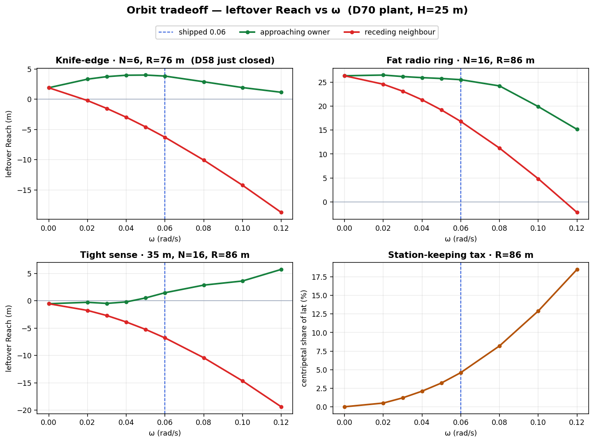

# Orbit vs cover

Why `kOrbitRate` is 0.06, why that number is only worth anything with
handoff, and why `CoverCloses` does not AND the red band under the
bracelet. The pictures are the D70 closed-form leftover-Reach vs ω;
the live picket is 20 m (D72) and sitting-wall (D71) closed a canary
waste that this sweep still shows. Decision write-up: D70.

Regenerate the figure: `python tools/plot_orbit_tradeoff.py`

Plant (not a live dump-params read): lat 6.71 m/s², maxv 20 m/s, H **25 m**,
sense 60 m unless stated. A ram leaves the circle, so intercept divert is
**full lat plus orbit velocity**. Centripetal `ω²R` is only paid while
holding the slot.

---

## The tradeoff is not symmetric

Tangential speed `v = ωR` is a head-start on the inbound *if* it already
points at the corridor. The facing drone's tangent is square across the
LOS — leftover **falls** with ω. The neighbour on the inbound side is
already closing — leftover **rises**, then falls when the ballistic
overshoots. Handoff (D66 / D67) is supposed to pick that neighbour.
Without it, orbit is D23: you handed the inbound to the worst drone on
the ring.

| | Approaching owner (handoff) | Receding neighbour |
|---|---|---|
| Knife-edge N=6, R=76 m | peaks **4.0 m** at ω ≈ 0.05 (was 1.9 from rest) | already negative at 0.02 |
| Fat N=16, R=86 m | already 26 m from rest; ω is a cost | burns with ω |
| Tight sense 35 m | from rest **open** (−0.55 m); more ω keeps helping | worse with ω |

Shipped **0.06** sits on the knife-edge plateau (3.83 m leftover), not on
the cliff. Centripetal share of lat at that rate, R=86 m: **4.6%**.

Theoretical peak on the just-closed six-picket ring is ω ≈ 0.04–0.05
with `a_c ≲ 5%` of lat. Formula that tracks it:
`ω = min(√(f·lat/R), v_use/R)` with f ≈ 0.03. Do **not** size ω from
`lat·t / R` — that saturates at maxv and wants ω ≈ 0.23 (D63 ground
deaths).

---

## Measured around that peak

Same 10 ids, after cover slack, **before** sitting-wall (D71). Canary
3/3 at 0.06 still had one wreckage (−40); D71 dropped that without
changing ω.

| ω rad/s | identity 8 | canary | fa56 | what happened |
|---:|---:|---|---|---|
| 0.04 | 145.9 | 45.4 3/3 | 87.4 3/3 | s1 wasted 1 (wreckage) |
| **0.06** | **150.7** | **45.5 3/3** | **83.5 3/3** | holds |
| 0.08 | 105.2 | 86.7 3/3 | −116.6 2/3 | s2 5/6 breach; fa56 breach |

Keep 0.06. 0.08 is past the plateau the way D63 named.

A layout-adaptive `ω(R)` is still the right *shape* (fat rings want
slower; tight-sense rings want more). Do not integrate `ω(R)·t` while R
shrinks — the ring would jump in phase. Boot from the full-fleet R, or
keep one constant. Left as a constant on purpose (`notes/GAPS.md`).

---

## Bracelet vs horizon

`CoverCloses` tests **one** inbound: the Voronoi edge between two
pickets, at elevation `atan(H/R)` — the green/red bracelet the overlay
scores as closed/hole. `ReachCover` also paints 0°–40° in 5° cells.
Cell 0° is the true horizon, the big red band **under** the ring.

D58 does not AND that cell into the shrink. A six-picket ring never
catches a ground-level bisector, and that abort would leave the radio
radius. An inbound flying under the belt is a lower elevation than the
bracelet, not a too-large R at picket height. Covering it is shrink-R
or the rejected AND, not a faster orbit.

Brain shrink is still **from rest**. The overlay now diverts around the
live ballistic point (`p + v t`), so it can read greener than the
planned ring while the fleet is orbiting.

---

## What this is not

- Not the union of sense spheres.
- Not a reason to grow R (D21).
- Not a reason to lower `kChasingToward` (D71: a sitting wall is a
  duplicate, not an interceptor).
- Not re-derived at H=20. The live default is 20 m (D72); the curves
  above are the D70 plant that picked ω.
