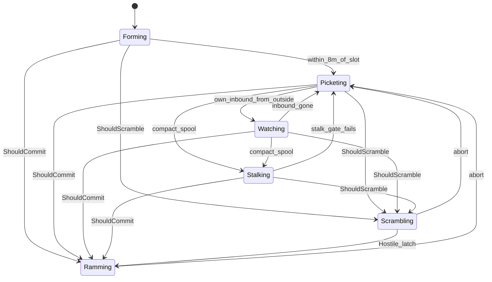

# Flight state machine

Policy names one `Mode` per tick. Flight is a `switch` on that mode, then
constraints. There is no Brake mode and no `likely` flag. While intercepting,
arena springs are off. If a collision is physically impossible, abort back to
picket. Scramble / ram fly a vector-ZEM collision course to the predicted
meeting point, not ProNav at the current body (D49). See D46 / D48 / D51.



## Modes

What the drone is actually doing. The inspector banner above the heading viz
uses these names; hover is the paragraph.

| Mode | In English | Accel | Yaw | Abort |
|---|---|---|---|---|
| **Forming** | Just spawned (or still en route). Flying out to its assigned slot on the picket ring. Not chasing anyone. Logs `picket` once it is within 8 m of the slot. | Cruise / GoTo station | watch if set, else outward | n/a |
| **Picketing** | On station. Holding the ring around the asset, facing outward, watching its sector. Has not spent itself. | GoTo (yielded) goal | outward | n/a |
| **Watching** | Still sitting on the ring, but turned toward an inbound it owns, classifying it. Does not leave the slot until 0.1 s of path-through-the-asset-cylinder (scramble) or a Hostile call (ram). | GoTo goal | at the inbound | n/a |
| **Stalking** | Eased a little off the slot toward a compact inbound that is not yet called Hostile. Cap is 40 m, so it can still reverse home if the latch never comes. | ProNav if `leashed`, else GoTo station | velocity | n/a |
| **Scrambling** | Left the ring on an **early** intercept **before** the Hostile latch. Same flight as a ram (arena springs off), but it will abort if the inbound is a civilian or a friend, or if the path no longer hits the asset. | Vector ZEM | velocity | soft (`not-threat` / `not-hostile`) |
| **Ramming** | Spent itself. Flying to **collide** with a Hostile. Arena springs are off. If the hit is impossible (past the merge, or leftover miss more than reach can close), abort. | Vector ZEM | velocity | hard (`timeout` / `not-closing` / `uncatchable` / lost / duplicate) |

`Forming` may still yaw at a watch target. That is a flag, not a seventh mode.
`state watch` is only logged once the drone is on station.

## Flags inside states

- **focus** — the track we face, stalk, or ram.
- **leashed** — Stalking only: still inside 40 m of the slot.

No `ram_likely`. Either the chase is still physically catchable, or we abort.

**Catchable** (`flight::CatchableRam`): inside 2·kill, stay in the merge. Past
CPA and outside that bubble, or leftover miss that `Reach` cannot close
(½ a t², max_speed, `LimitAccel` along the miss) at t_cpa or up to 2 s
past it, is `abort uncatchable` on **Ramming** after 0.4 s. Scramble is
not tested — it just left the ring.

A 2·kill leftover at the merge is the obvious miss that test describes;
long-range intercepts with time to divert are still catchable.

**Arena.** Leaving the arena is a wasted loss. Walls, ceiling, and ground
springs apply on station (Forming / Picketing / Watching / Stalking).
Scrambling and Ramming skip the whole box — a ram that can still hit must
not be steered around a wall. After `uncatchable`, we are picketing again
and the springs come back.

Separation still runs on intercepts (D15 / D38).

## Logs

On mode change only:

```
state ram from=watch trk=12
state forming
state stalk from=picket trk=3 leashed=1
abort trk=12 uncatchable close=-2.1 rng=8 ttg=1.2 held=2.4 now=hostile
```

`commit` / `abort` / `picket` stay so CommitIndex and the Aim cue do not
change. The inspector banner above the drone viz (and Beliefs → Stance)
reconstructs the live mode from `state`; click jumps to that log line.
Hover is the English above, not the token.
