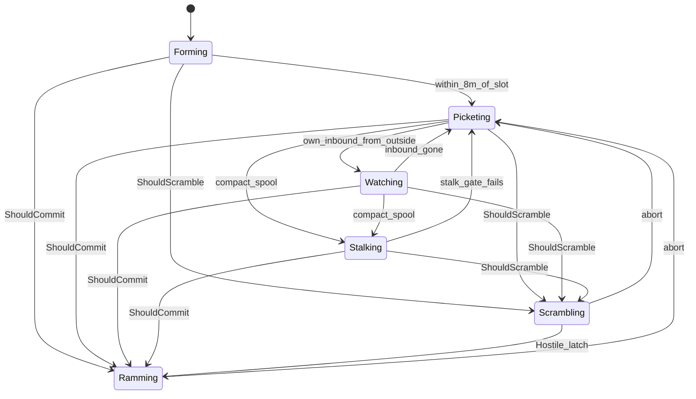

# Flight state machine

Policy names one `Mode` per tick. Flight is a `switch` on that mode, then
constraints. There is no Brake mode and no `likely` flag. While intercepting,
arena springs are off. If a collision is physically impossible, abort back to
picket. Scramble / ram fly a vector-ZEM collision course to the predicted
meeting point, not ProNav at the current body (D49). t_go is a held
clock (last t minus dt) while that meeting still hits; it is not a
fresh t-bin every tick and not `(t − τ)²` (D62). The Aim cue is
that meeting (`in=/ie=`), not the believed body. Station altitude is the
inbound cone at the picket radius once the fleet has a linear ray (D52),
else 20 m (cap still 30 m, D72), and never below the kill-envelope floor
(`R·tan(10°)` or half the first-sight Reach pancake, D68). Stations even
over the live roster (hopped heartbeats, D56). Radius shrinks if that
`(R, H)` cannot catch the Voronoi-edge inbound (D58).
See D46 / D48 / D51 / D56 / D58 / D68.



## Transitions

Each label on the diagram is one predicate. Scramble and ram beat station
modes: if `ShouldCommit` or `ShouldScramble` is true this tick, we leave
whatever station we were in.

| Edge | When it fires | What that means |
|---|---|---|
| **within_8m_of_slot** | Distance to the *current* station &lt; 8 m, and we are not intercepting. Sticky: `announced_picket_` stays true. | We have arrived. Log `picket`. Forming ends. The slot can still move (deaths, ray altitude); we do not go back to Forming. |
| **own_inbound_from_outside** | On station (`announced_picket_`), we own a **local** track that first appeared at or outside the ring, and we do not already own a Hostile. | Yaw at it. Do not leave the slot. This is Watching, not a chase. |
| **inbound_gone** | That watch track is gone this tick (lost, no longer owned, or a Hostile we own took priority). | Face outward again. Still Picketing. |
| **compact_spool** | We own a diving inbound that is still spooling (&lt; 0.6 · dash speed) and `ThreatWindow` &lt; 8 s. Slide at most 40 m toward a short lead on its track. | Stalking. Can reverse home if Classify never latches. Used when they spawn inside sense, still accelerating. |
| **stalk_gate_fails** | The compact-spool test fails this tick (sped up, window opened, no longer owned, or we committed). | Back to the slot. `leashed` was whether we were still inside 40 m. |
| **ShouldScramble** | Local, not Friendly / Wreckage / Hostile. Ground track has crossed the asset cylinder for **0.1 s**. First seen from outside the ring. We own it. Nobody else is clearly closer. No fresh Hostile we already own. | Leave the ring *before* the Hostile call. Same flight as a ram; abort if it is a civilian or the path stops hitting the asset. |
| **ShouldCommit** | Belief is **Hostile**, call younger than 6 s, we own it, relative closing ≥ 1 m/s, and cruise along the LOS arrives 0.5 s before they hit the cylinder. Hearsay is allowed (s2). | Spend the airframe. Ram. Unknown is not this — we do not ram on a guess. |
| **Hostile_latch** | Already Scrambling, and that track's belief becomes Hostile. | Rename to Ramming. Same guidance. Abort rules get stricter. |
| **abort** | See abort table below. | Station-keeping again. Arena springs come back. 2 s before we re-chase the same track. |

**Who owns an inbound.** Facing slot among the **live** equally-spaced
stations, then that live id. A receding owner yields one step clockwise
on the live ring. Two observers on a bisector name the same owner. A mate
already flying at it (closing along the LOS ≥ 5 m/s) is the interceptor;
we abort as `duplicate`. With the orbit on, a challenger with a better
`InterceptScore` takes the inbound (`kHandoff`). Approaching incumbent:
must win by `kHandoffMargin` seconds of score (default 0.25, D69). Receding
incumbent, same t_go bin: also if closing faster by `kHandoffAspect` m/s
(default 0.5) — that is the facing drone whose tangential velocity is
square across the corridor (D67). Both knobs are in `policy.h`. Ring
radius shrinks until the unique-owner inbound at picket height has 5 m
of leftover Reach (D70), not until leftover is exactly 0.

## Modes

What the drone is actually doing. The inspector banner above the heading viz
uses these names; hover is the paragraph.

| Mode | In English | Accel | Yaw | Abort |
|---|---|---|---|---|
| **Forming** | Just spawned (or still en route). Flying out to its assigned slot on the picket ring. Not chasing anyone. Logs `picket` once it is within 8 m of the slot. | Cruise / GoTo station | watch if set, else velocity | n/a |
| **Picketing** | On station. Holding the ring around the asset, heading along the orbit tangent (outward if parked), watching its sector. Has not spent itself. Altitude is 20 m until an inbound cone is ready, then the predicted height at this radius (capped at 30 m). | GoTo (yielded) goal | velocity | n/a |
| **Watching** | Still sitting on the ring, but turned toward an inbound it owns, classifying it. Does not leave the slot until 0.1 s of path-through-the-asset-cylinder (scramble) or a Hostile call (ram). | GoTo goal | at the inbound | n/a |
| **Stalking** | Eased a little off the slot toward a compact inbound that is not yet called Hostile. Cap is 40 m, so it can still reverse home if the latch never comes. | ProNav if `leashed`, else GoTo station | velocity | n/a |
| **Scrambling** | Left the ring on an **early** intercept **before** the Hostile latch. Same flight as a ram (arena springs off), but it will abort if the inbound is a civilian or a friend, or if the path no longer hits the asset. | Vector ZEM | velocity | soft (`not-threat` / `not-hostile`) |
| **Ramming** | Spent itself. Flying to **collide** with a Hostile. Arena springs are off. If the hit is impossible (past the merge, or leftover miss more than reach can close), abort. | Vector ZEM | velocity | hard (`timeout` / `not-closing` / `uncatchable` / lost / duplicate) |

`Forming` may still yaw at a watch target. That is a flag, not a seventh mode.
`state watch` is only logged once the drone is on station.

## Abort

| Reason | Who | Meaning |
|---|---|---|
| `lost` | both | Track vanished (dead, out of sense, hearsay aged out). |
| `duplicate` | both | Another friendly is clearly closer, or similar range and lower id. A sitting ring wall (inbound running onto them, toward can be negative) also counts if they are ≥ 12 m closer and not the facing incumbent (D71). |
| `timeout` | both | 12 s since we left. One spawn interval is ~14 s; come home. |
| `not-hostile` | both | Class is no longer Hostile (scramble: also Friendly / Wreckage). |
| `not-threat` | scramble only | Cylinder LOS gone, or a level overflight that never dived (1 s). |
| `not-closing` | ram only | After 6 s, relative closing &lt; 1 m/s (stern chase we cannot win). |
| `uncatchable` | ram only | After 0.4 s, leftover miss is more than reach can close. |

**Catchable** (`flight::CatchableRam`): inside 2·kill, stay in the merge. Past
CPA and outside that bubble, or leftover miss that `Reach` cannot close
(½ a t², max_speed, `LimitAccel` along the miss) at t_cpa or up to 2 s
past it. Scramble is not tested — it just left the ring.

## Flags inside states

- **focus** — the track we face, stalk, or ram.
- **leashed** — Stalking only: still inside 40 m of the slot.

No `ram_likely`. Either the chase is still physically catchable, or we abort.

**Arena.** Leaving the arena is a wasted loss. Walls, ceiling, and a
**hard** ground constraint apply on station and while scrambling: inside
the vertical stopping band, az is replaced and never commands down (D68).
Ramming keeps walls/ceiling off and the old soft floor (D64). After
`uncatchable`, we are picketing again and the hard floor comes back.

Separation still runs on intercepts (D15 / D38).

## Logs

On mode change only:

```
state ram from=watch trk=12
state forming
state stalk from=picket trk=3 leashed=1
abort trk=12 uncatchable close=-2.1 rng=8 ttg=1.2 held=2.4 now=hostile
```

`commit` / `abort` / `picket` stay so CommitIndex and the Aim cue do not
change. The inspector banner above the drone viz (and Beliefs → Stance)
reconstructs the live mode from `state`; click jumps to that log line.
Hover is the English above, not the token.
